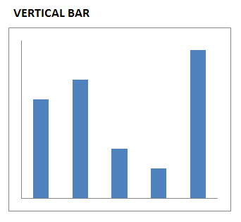
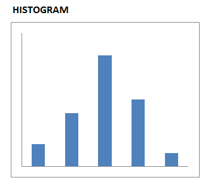

# 3. How to Choose the Type of Data Visualization

Now that we have established the audience and the message, it is time to design the visualizations. This section will help identify which forms are best, depending on the data and message. 

### 3.1.1 Determine the Best Type of Visualization to Use

Many authors have described which graph to choose depending on the situation and what is intended to be shown. The designer can experiment and decide which type of visualization to use. The guide below should help, although the ultimate judge will be the audience and how well they understand and act on the message. Repeatedly ask yourself: "What is the message?", and decide whether it is clearly delivered. Try creating multiple visualizations for that message, and ask a trusted colleague for feedback about which works best for the intended message.

### 3.1.2 Overview of Main Types of Visuals and Key Uses

LINE

1. Standard Line Graph - Time series and trends, parts-to-a-whole, distribution 
2. Slopegraph - comparison of multiple variables at once, for two points in time 
3. Sparklines - small version of minimalist line graph, shows changes in value over time at-a-glance

BAR (Vertical or Horizontal)

1. Value comparison, or ranking
2. Parts-to-a-whole, including stacked bars to show shares of sub-categories within a categorical variable
3. Histogram (i.e., distribution of values)
   
SCATTERPLOT

1. Exploratory data analysis
2. Correlation between two variables
3. Time series
      
TEXT - when a key single value is all that needs to be communicated. 

TABLE - best used only as a lookup reference table, rather than for communicating a message, since tables get cluttered so easily and don't otherwise send a clear message. However, a heatmap table is a variation of a table with color-intensity-encoded cells to highlight high and low values, and can be used effectively to communicate a trend or relationship.

SMALL MULTIPLES (i.e., Facet, or Trellis charts) - can be used with any type of data visualization, to compare many variables or categories at once, to observe relationships or the correlation of each combination of two categories.

Of course there are many others, such as MAPSs to compare states, and BOXPLOT and VIOLIN charts to show distributions, etc.

### 3.1.3 Visualizations to Avoid

Many common visualizations do not actually communicate the message effectively. Some reasons for this include science about how the human eye and brain work, and what is most effectively deciphered. Below are some common graph types, with a brief description of why they should be avoided.

* Pies and Donuts - the human eye can not accurately compare angles and area of pie or donut slices. Try stacked bar.

* 3D - due to the perspective, the human eye cannot accurately compare relative values three dimensionally. Try using color.

* Area - the human eye does not decipher area effectively. Try vertical bars.

* Double-Axis - too much for a reader to process quickly and effectively. Try separating the graphs vertically with the same x-axis and different y-axes.

     
### 3.1.4 Questions to help determine which type of visualization to use:

*	What is the **simplest** way the information can be conveyed?

*	Have I tried other ways of displaying the information?

*	Have I shown a draft visualization to another person for feedback on how effectively it conveys the message?

## 3.2 Examples

![Text]
[Text]

Simple text is useful when you have one or two numbers to show.
!(choosing_pics/TEXT.PNG)

    

Heatmaps can ease the identification of low and high values, or reveal data patterns.

       
Line graphs imply continuous data or a connection between the points. Line graphs can include a shaded range or confidence interval around an average.

Line graphs are best for:

* Time series
* Combining a deviation relationship (such as a difference from plan)
* Viewing a (smoothed) cumulative distribution, or multiple related histograms on a single graph.

   
Sparklines can be valuable for seeing trends or highlighting minimum and maximum values. Typically used in a minimalist way.
              

   
Slopegraphs can be useful when showing data for just two time periods and you want to easily show relative decreases or increases among several categories.

Slopegraphs can get cluttered, and should hence be avoided when there are too many overlapping lines.

       
Vertical bar charts are useful for time series graphs where you want to focus on the comparison between values of individual points, rather than on the overall pattern of values over time. Vertical bar charts can also be useful in showing deviation relationships (e.g., difference from plan) at a point in time. 

Avoid using more than 3 sub-categories within bars, as this may obscure the intended message. 

       
Use caution in using stacked vertical bar charts, as it can be hard to compare sizes or values, especially if the baseline for a given 'stack' is not the same. Thus, stacked vertical bar charts are best if there’s a key category you are focusing on and that it’s positioned as the bottom set of bars as in the example. Consider using absolute numbers in stacked vertical bar charts or using stacked vertical bars that each sum to 100%.

       
A histogram is a vertical bar chart used to display a distribution.

       
Horizontal bar charts are great for displaying categorical data, especially if using the categories to rank the values. Horizontal bars are also useful for long category names that won't fit as well for a vertical bar format.

       
Stacked horizontal bar charts displaying absolute numbers or individual bars that sum to 100% can be useful for:
  
* Showing parts of a whole
* Featuring totals and providing an approximate sense of the parts

As an alternative, consider pulling the stacked bars apart into a single ranking horizontal bar chart whose percentage totals add to 100%.
   

    
Waterfall charts are useful to show a starting point, incremental increases and/or decreases, and an ending point.  

    
Scatterplots are useful to show the relationship between two variables or correlations between items. Use care when using scatterplots as they are not well understood by all audiences. Consider using two horizontal bar charts side-by-side organized in the same order, also called a table lens as an alternative.

    
Dot plots are useful for nominal comparative relationships where you want to highlight differences that would be hard to see in a bar graph that must have a zero baseline. These are also useful for showing time series data not representing consistent intervals of time.

 
Box & whisker plots display a large amount of distribution data in a single graphic: the highest and lowest values, the spread of values from highest to lowest, the median, and the 25th and 75th percentiles. Use box & whisker plots with care as percentiles are not readily understood by all audiences; consider simplifying to only show what is neededa high, median, and low box plot without whiskers
       

Violin plots provide a truer shape of the distribution than a boxplot.

   
Maps are valuable for displaying geospatial information. One can use intensities of color applied to a state to reveal the data value.
