# How to Choose the Type of Data Visualization

```{r include = FALSE}
knitr::opts_chunk$set(
   echo = FALSE
)
```

Now that we have established the audience and the message, it is time to design the visualizations. This section will help you identify the best forms for the data and message. 

## Determine the Best Type of Visualization to Use

Many authors have described how to select the particular graph type that fits the data and message. Using the guide below, you can then experiment and decide which type of visualization to use. Remember, the **ultimate judge of the appropriateness of a visual is: how effectively does the audience understand and act on the message**? Repeatedly ask yourself: “What is the message?”, and decide whether it is clearly delivered. Try creating multiple visualizations for that message and ask a trusted colleague for feedback about which visualization works best for the intended message.

### Examples of the Main Types of Visuals and Key Uses

Simple text is useful when you have one or two numbers to show.

```{r }
knitr::include_graphics('figures/TEXT.PNG')
```


```{r }
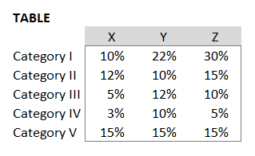
```

A simple table is best used only as a lookup reference table and not for communicating larger messages. For any type of message conveyed in a table, try a heatmap table as shown next.

```{r }
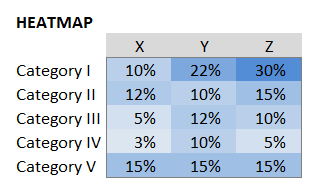
```

A heatmap table is a variation with color-intensity-encoded cells to highlight high and low values and can be used effectively to communicate a trend or relationship.


```{r }
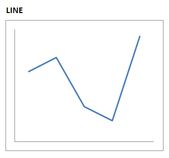
```

Line graphs imply continuous data or a connection between the points. Line graphs can include a shaded range or confidence interval around an average.

Line graphs are best for:

   * Time series
   * Combining a deviation relationship (such as a difference from plan)
   * Viewing a (smoothed) cumulative distribution.


**SPARKLINES
```{r }
knitr::include_graphics('figures/Sparklines.PNG')
```

Sparklines can be valuable for seeing trends at-a-glance or highlighting minimum and maximum values. Typically used in a minimalist way.

```{r }
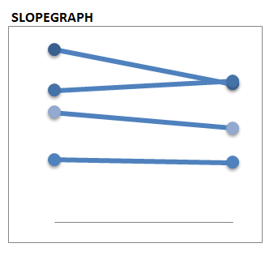
```
              
Slopegraphs can be useful when showing data for just two time periods and when you want to easily show relative decreases or increases among several categories. These graphs can get cluttered, and should be avoided when there are too many overlapping lines.

```{r }
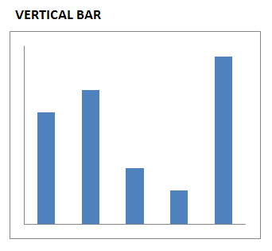
```

Vertical bar charts are useful for time series graphs where you want to focus on the comparison between values of individual points, rather than on the overall pattern of values over time. Vertical bar charts can also be useful in showing deviation relationships (e.g., difference from plan) at a point in time. 

```{r }
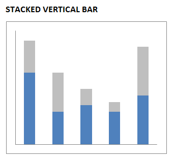
```

Use caution in using stacked vertical bar charts, as it can be hard to compare sizes or values, especially if the baseline for a given 'stack' is not the same. Thus, stacked vertical bar charts are best if there is a key category of focus, which should be placed as the bottom set of bars. Consider using absolute numbers in stacked vertical bar charts or using stacked vertical bars that each sum to 100%. Avoid using more than two or three sub-categories within bars, as this may obscure the intended message. 

```{r }
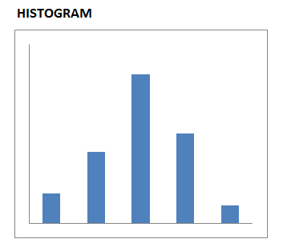
```

A histogram is a vertical bar chart used to display a distribution.

```{r }
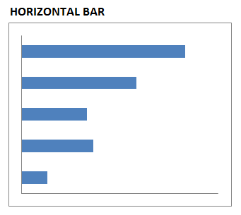
```

Horizontal bar charts are great for displaying categorical data, especially if using the categories to rank the values. Horizontal bars are also useful for long category names that won't fit as well for a vertical bar format.

```{r }
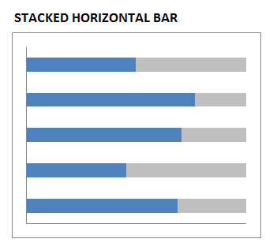
```

```{r }
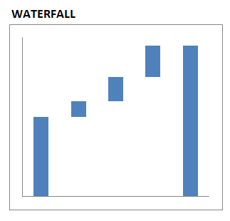
```

Waterfall charts are useful to show a starting point, incremental increases and/or decreases, and an ending point.  

```{r }
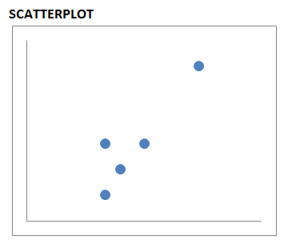
```

Scatterplots are useful to show the relationship between two variables or the correlations between them. Use care when using scatterplots as they are not well understood by all audiences. Scatterplots can also be useful for exploratory data analysis and initial visual evaluation of correlation between two variables.

```{r }
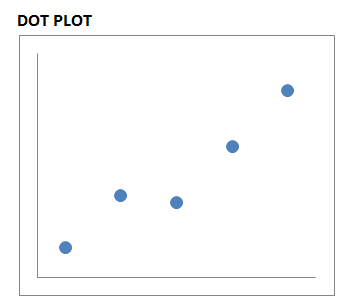
```

Dot plots are useful for nominal comparative relationships when you want to highlight differences that would be hard to see in a bar graph that has zero as the baseline. Dot plots are also useful for showing time series data not representing consistent intervals of time.

```{r }
knitr::include_graphics('figures/BOXPLOT_IRIS.PNG')
```

Box & whisker plots display a large amount of distribution data in a single graphic: the highest and lowest values, the spread of values from highest to lowest, the median, and the 25th and 75th percentiles. Use box & whisker plots with care as percentiles are not readily understood by all audiences; consider simplifying to only show what is needed.

```{r }
knitr::include_graphics('figures/VIOLIN_IRIS.PNG')
```

Violin plots provide a truer shape of the distribution than a boxplot.

```{r }
knitr::include_graphics('figures/USMAP.PNG')
```

Maps are valuable for displaying geospatial information. One can use intensities of color by state or region to reveal the data value.


SMALL MULTIPLES  - also called facet, or trellis plots. These exhibits repeat the same plot more than once, with subsets of data in each plot, as demonstrated in Figure \@ref(fig:small-multiple-plot). The plots are placed side by side to facilitate comparison. The subsetting is based on some categorical element like territory, vehicle class, predictor, etc. Small multiples are used to compare data across categories, to observe relationships or the correlation of each combination of two categories.

```{r small-multiple-plot, fig.cap = "Small multiples"}
mtcars %>% 
   ggplot(aes(wt, mpg)) + 
   geom_point() +
   facet_wrap(~cyl, labeller = label_both, scales = 'free_x') + 
   labs(x = 'Vehicle weight', y = 'Miles per gallon')
```

Of course there are many others, such as maps to compare states, and b and boxplot and violin charts to show distributions, etc.

### Visualizations to Avoid

Many common visualizations do not actually communicate the message effectively. These are less effective due to the science of how the human eye and brain work, and what is most effectively deciphered. Below are some common graph types, with a brief description of why they should be avoided.

* Pies and Doughnuts - the human eye can not accurately compare angles and area of pie or doughnut slices. Try stacked bar.

* 3D - due to the perspective, the human eye cannot accurately compare relative values three dimensionally. Try using color.

* Area - the human eye does not decipher area effectively. Try vertical bars.

* Double-Axis - too much for a reader to process quickly and effectively. Try separating the graphs vertically with the same x-axis and different y-axes.

     
### Questions to help determine which type of visualization to use:

*	What is the **simplest** way the information can be conveyed?

*	Have I tried other ways of displaying the information?

*	Have I shown a draft visualization to another person for feedback on how effectively it conveys the message?

