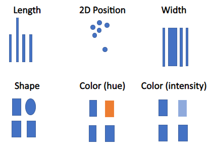
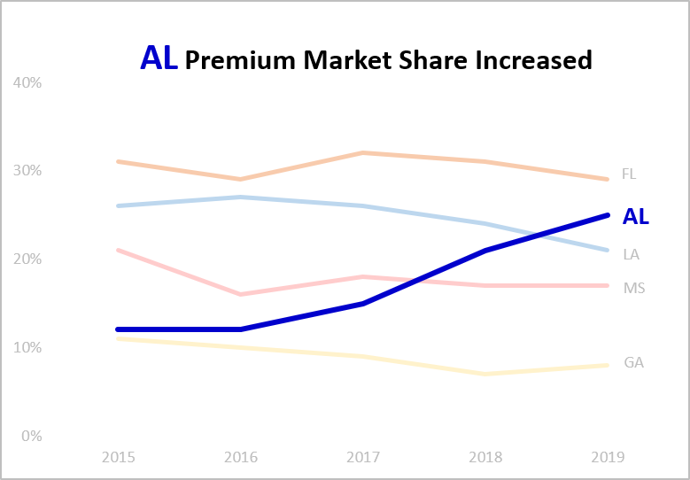

# How to design the visualization

```{r include = FALSE}
knitr::opts_chunk$set(
   echo = FALSE
)
```

In this section we provide some techniques for how to design a data visualization to render a crisp graphic that highlights the message.
Two techniques described in this section are:

* **Decluttering** to remove what's not needed, and
* **Accentuating** to highlight what is crucial


## It is Important to Declutter

Clutter is the enemy in a graphic. Lines, colors, fonts, etc. in default graphicss tend to be overly busy. One must expend the effort to declutter data visualizations to maximize the clarity of the message. Below, we describe a few concepts related to decluttering: cognitive load and data-to-ink ratio.


### Cognitive Load

is a concept discussed in [@Knaflic]. Consuming information takes brain power. A viewer has limits on their short-term working memory. Viewers can only store three to four pieces of information at a time, which means that cluttered and poorly designed data visualizations increase a viewer's 'cognitive load' and reduce what they can retain. The data visualization author must design with the audience's cognitive load in mind. Without this consideration, the message gets lost altogether or takes the audience more time and energy to absorb (i.e. more than they may be willing or able to expend). Decluttering reduces cognitive load by minimizing what the brain needs to see and process, which enables the reader to see the relevant data and message more clearly. Think "less is more".


### Data-to-Ink Ratio 

is a concept discussed in *The Visual Display of Quantitative Information* [@Tufte2001]. Each dot of 'ink' on the visualization is valuable, and can be used to either display the data or to clutter a visualization. The author should create data visualizations with a focus on using 'ink' to display data in order to convey the message, compared to the amount of 'ink' used for text, lines, borders, or color/shading.


### How to Declutter

Remove the following entirely. Alternatively, or use gray font or line color to tone-down the cognitive load of the following:

* Borders - generally not needed and only obscure key data ink
* Axis lines - the eye automatically sees a line created by the vertical or horizontal labels, or bars
* Gridlines - only keep if they serve a clear purpose
* Axis tick marks - keep the categorical label but remove the horizontal or vertical line marks '-' themselves
* Gray color - use for data or text that is not the primary focus of the visualization 
* Axis names - use shorter yet descriptive names to describe axes
* Legends - omit legends and label the data directly
* Titles - combine the title and the message into a single phrase
		
**Legends** are commonly used in graphs. However, the viewer must move their eyes back and forth from the graphed data to the legend, which takes time and increases cognitive load. If possible, place the label describing the data directly adjacent to the data. If possible, place the label directly adjacent to its data. Apply the same color, weight, line-type, etc. for the text of the data label as use for its data (direct labeling). This approach may not work for all graph types or for all data. For example, if the lines in a graph are crossing each other, then direct labeling might not work effectively. 

**Y-axis labels** should not use vertical text. It is common to see y-axis labels that are oriented at a 90-degree angle from the x-axis, reading upwards. No one reads this way easily. Vertical orientation is more difficult to read and is a form of cognitive load; at a minimum it slows down the reader's ability to quickly identify the axis. Instead, try arranging the vertical-axis label horizontally at the top left of the axis the way we naturally read, or include the vertical axis label within the graph title.


## How to Accentuate to Make the Data ‘Pop’

We have any tools to draw our viewers attention, and highlight elements that important for message to stand out. We'll discuss two (similar) schools of thought that describe ways that the human eye and brain perceive our world.


###  Gestalt principles

(Gestalt School of Psychology, 1912). These principles have identified how the eyes and brain work to visually connect things together and make sense of our world. The following principles apply:
	
* Proximity - The brain naturally groups together items that are closer together. We can design our data visualizations to direct the patterns our viewer to see, by placing the relevant items in close proximity.

* Similarity - Objects with similar size, color, shape, font, or angular orientation are perceived by the brain to be part of the same group. 

* Enclosure - Using some type of border or shading can render data or multiple objects to be associated as grouped objects.  

* Continuity - The brain will attempt to enclose things (lines, objects) that aren't even necessarily fully enclosed by a solid line. The brain will likely 'fill in' a dashed line to perceive it as enclosing something if it can be interpreted that way. The brain may perceive a border to exist when objects are lined up; for example, bars lined up along the x-axis could serve as a graph's x-axis border even if the border isn't shown.

* Connection - This principle is commonly used in line graphs to literally 'connect the dots' for the viewer.


### Pre-attentive Attributes [@Few2012]

The human eye and brain are programmed to perceive a specific set of visual attributes very quickly and with a high rate of accuracy.
	
	
Attributes of Form

* Length 		- can be quantitatively perceived.
* Width 		- can be quantitatively perceived, but limited in accuracy.
* Size  		- can be quantitatively perceived, but limited in accuracy.
* Spatial position 	- can be perceived and contrasted in vertical and horizontal position fairly well, but only in *two* dimensions not three dimensions
* Shape 		- *cannot* be quantitatively perceived.
* Orientation in 2D 	- *cannot* be quantitatively perceived.
* Enclosure 		- *cannot* be quantitatively perceived.


Attributes of Color

* Hue refers to color. Hue can be described by the location on a standard color wheel. Color combinations that work well together, and are distinct enough from one another, can be found on the website ColorBrewer.org.
* Intensity refers to 'fullness' of a color (saturation), and lightness or darkness of a given color.

Below are some examples of how pre-attentive attributes could be used to distinguish and compare values or objects.
```{r}

```
		
* Note that _area, volume, angle, and depth are all omitted from the list of pre-attentive attributes_, since the human eye cannot easily decipher differences in these. This is why we should generally avoid pie, 3D, area, and bubble charts. There are some exceptions. For example, some designers would say it might be ok to use pie charts with only two variables. Some others might say that it is ok to use treemap and bubble charts sparingly, to show generalities rather than precise differentiation between very similar quantities.


## Before-and-After Example of Data Visualization
In the two graphs below, we have attempted to show a *before* and *after* version of a graph.


**Before** we've applied data visualization basic techniques using default settings, we can hardly see the data, and we certainly cannot tell what the message is or even what to focus on.
```{r }
knitr::include_graphics('figures/market_share_left.png')
```
* Too many border and axis lines, and the gridlines actually *hide* the lines representing the data
* Too many Y-axis labels, the color is too dark and/or lines are too thick, all draw our attention away from the data and increase cognitive load
* Color is used to differentiate the lines, and they are even color-coded with the legend, although they each have bright colors so it isn't clear what to focus on
* The legend requires the eye has to look back and forth from the data lines to the legend
* The title is long and cumbersome, and we still don't know what the message is


**After** we've applied data visualization basic techniques, we can clearly tell what the message from the title and color choices. The axis amounts and other state's information is visible but given less emphasis with gray or muted color.
```{r }

```
* No many gridlines, border or axis lines. We don't miss them as they leave the data to focus on
* Fewer Y-axis labels; still allowing for reference for the lines
* Color is used to differentiate the lines, but muted tones for other states and darker for the focus state.
* The legend is omitted entirely, rather each line is direct-labeled and very easy to tell which line goes with each state.
* The title tells the reader what the message is, and uses color-matching with the line and line label.

Which one would you rather see as a viewer? With some effort and knowledge, you can see dramatic improvements in getting the message across, and reducing the cognitive load of the viewer.

