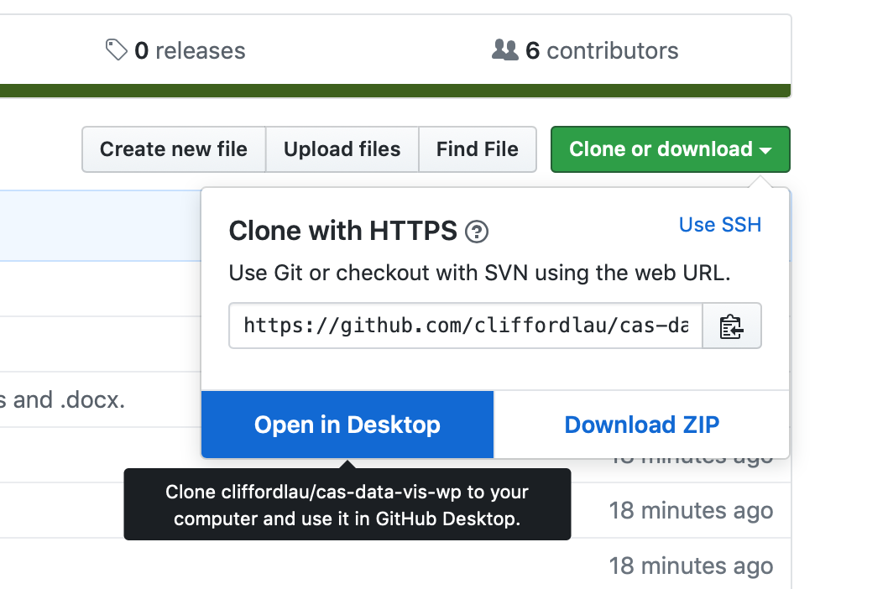
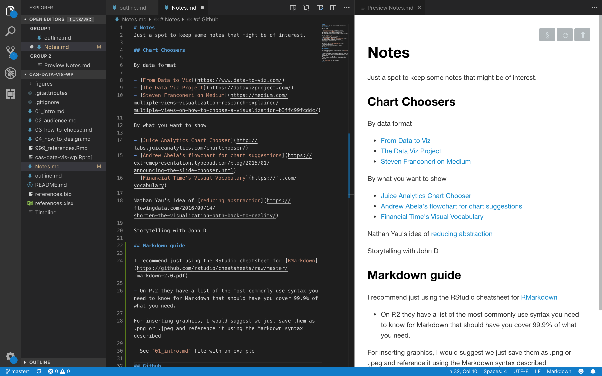
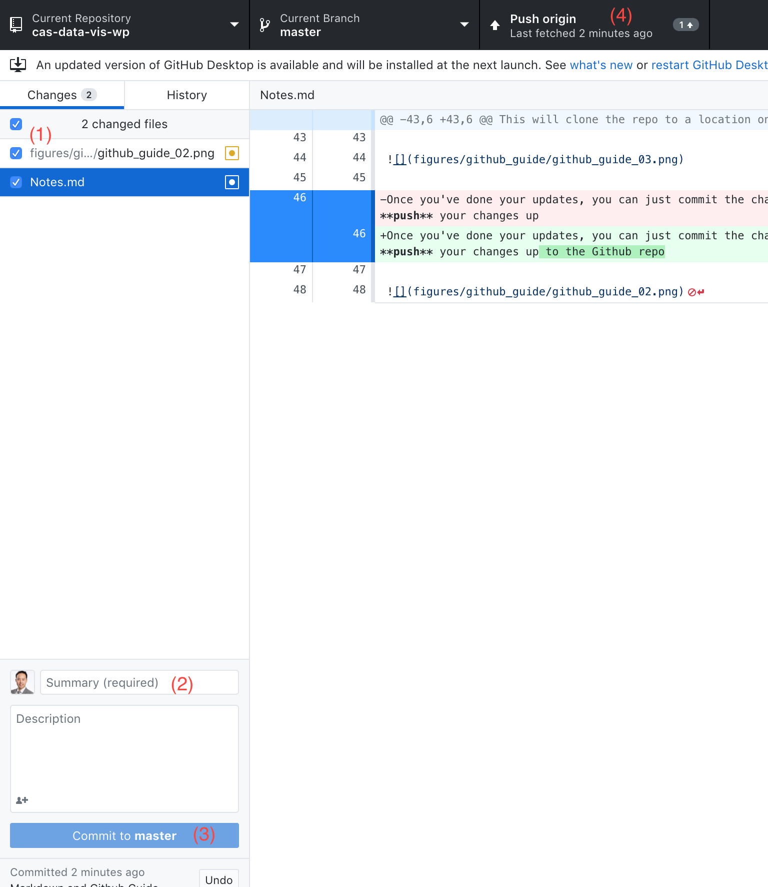

# Notes
Just a spot to keep some notes that might be of interest.

## Chart Choosers

By data format

- [From Data to Viz](https://www.data-to-viz.com/)
- [The Data Viz Project](https://datavizproject.com/)
- [Steven Franconeri on Medium](https://medium.com/multiple-views-visualization-research-explained/multiple-views-on-how-to-choose-a-visualization-b3ffc99fcddc/)

By what you want to show

- [Juice Analytics Chart Chooser](http://labs.juiceanalytics.com/chartchooser/)
- [Andrew Abela's flowchart for chart suggestions](https://extremepresentation.typepad.com/blog/2015/01/announcing-the-slide-chooser.html)
- [Financial Time's Visual Vocabulary](https://ft.com/vocabulary)

Nathan Yau's idea of [reducing abstraction](https://flowingdata.com/2016/09/14/shorten-the-visualization-path-back-to-reality/)

Storytelling with John D

## Markdown guide

I recommend just using the RStudio cheatsheet for [RMarkdown](https://github.com/rstudio/cheatsheets/raw/master/rmarkdown-2.0.pdf)

- On P.2 they have a list of the most commonly use syntax you need to know for Markdown that should have you cover 99.9% of what you need.

For inserting graphics, I would suggest we just save them as .png or .jpeg and reference it using the Markdown syntax described

- See `01_intro.md` file with an example

## Git and Github on the Desktop

If you want to do some heavy lifting or serious edits, it might be easier to clone the repo on your desktop and edit using a text editor.

The easiest way to do this is via the github desktop client and ou can download it [here](https://desktop.github.com)

Once you have the client installed, when you go clone the repo from github, you have the option to open in desktop

This will clone the repo to a location on your desktop and then you can use whatever text editor you like (e.g. [VS Code](https://code.visualstudio.com))

Once you've done your updates, you can just commit the changes you've made like you've done on the Github website. The only additional thing you have to do is **push** your changes up

